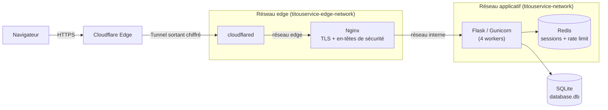
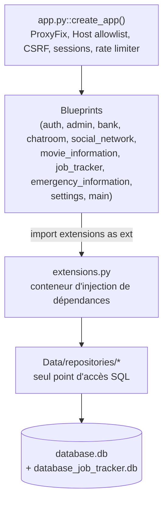

# TitouService

[](https://github.com/titou4n/titouservice/actions/workflows/docker-deploy.yml)
[](LICENSE)

Plateforme web modulaire construite avec **Flask** et **Docker Compose**, regroupant plusieurs services indépendants (authentification, administration/RBAC, réseau social, forum, banque simulée, suivi de candidatures, recherche de films, informations d'urgence, paramètres utilisateur) derrière une seule application.

**Instance en production :** [https://titouservice.ltjs.net](https://titouservice.ltjs.net)

> Aucune capture d'écran n'est disponible dans ce dépôt à ce jour. Si des visuels sont ajoutés (dossier `docs/images/` ou `screenshots/`), pensez à les référencer ici.

---

## Sommaire

- [Présentation](#présentation)
- [Fonctionnalités principales](#fonctionnalités-principales)
- [Architecture générale](#architecture-générale)
- [Stack technique](#stack-technique)
- [Structure des dossiers](#structure-des-dossiers)
- [Prérequis](#prérequis)
- [Installation](#installation)
- [Configuration](#configuration)
- [Variables d'environnement](#variables-denvironnement)
- [Lancement en développement](#lancement-en-développement)
- [Lancement avec Docker](#lancement-avec-docker)
- [Lancement en production](#lancement-en-production)
- [Commandes utiles](#commandes-utiles)
- [Tests](#tests)
- [Formatage / Lint](#formatage--lint)
- [Base de données](#base-de-données)
- [Authentification](#authentification)
- [Routes applicatives](#routes-applicatives)
- [Sécurité](#sécurité)
- [CI/CD](#cicd)
- [Contribution](#contribution)
- [Licence](#licence)
- [FAQ](#faq)

---

## Présentation

TitouService est une application web monolithique organisée en **blueprints Flask indépendants**, chacun portant une fonctionnalité métier complète (routes, logique, parfois ses propres permissions). Les données persistent dans **SQLite**, les sessions et le rate-limiting s'appuient sur **Redis**, et la mise en production passe par **Nginx** (TLS + en-têtes de sécurité) exposé au monde uniquement via un **tunnel Cloudflare** (`cloudflared`) — aucun port n'est ouvert directement sur l'hôte.

Le projet ne dispose pas de suite de tests automatisés à ce jour ; la qualité est surveillée via une série d'audits de sécurité versionnés dans [`audits/`](audits/) (non suivis par Git, voir [Sécurité](#sécurité)).

## Fonctionnalités principales

| Module | Préfixe d'URL | Fonctionnalités |
|---|---|---|
| **Authentification** (`auth`) | `/` | Inscription, connexion, déconnexion, 2FA par e-mail (code à 6 chiffres, PBKDF2, expiration 15 min, 3 tentatives max) |
| **Administration** (`admin`) | `/admin_panel` | Gestion des rôles et permissions, attribution de rôles (garde-fous anti élévation de privilèges) |
| **Paramètres** (`settings`) | `/settings` | Modification du profil (e-mail, pseudo, nom, mot de passe, photo de profil), export/suppression de compte, gestion des sessions actives, activation 2FA, préférences de notifications |
| **Banque simulée** (`bank`) | `/bank` | Solde de départ virtuel, virements entre comptes, retraits, marché boursier simulé (achat/vente) |
| **Forum / Chatroom** (`chatroom`) | `/chatroom` | Création, édition et suppression de messages publics |
| **Réseau social** (`social_network`) | `/social_network` | Abonnements (follow/unfollow), profils publics, messagerie privée entre utilisateurs |
| **Recherche de films** (`movie_information`) | `/movie_information` | Recherche et fiche détaillée via l'API OMDB |
| **Suivi de candidatures** (`job_tracker`) | `/job_tracker` | Tableau kanban des candidatures, gestion des entreprises, tableau de bord, statistiques (Chart.js) |
| **Informations d'urgence** (`emergency_information`) | `/emergency_information` | Fiche médicale/contacts d'urgence, lien public à jeton haute entropie (`/emergency_information/public/<token>`), panneau d'administration dédié |
| **Accueil / système** (`main`) | `/` | Page d'accueil, `/health` (sonde de disponibilité), graphique de connexions |

Chaque route sensible est protégée par les décorateurs `@login_required` et `@require_permission("...")` définis dans `utils/decorators.py`, qui s'appuient sur le modèle de permissions décrit ci-dessous.

## Architecture générale

### Flux de requête (production)



Aucun port n'est publié sur l'hôte : `cloudflared` est le seul point d'entrée public, relié à Nginx via un réseau Docker dédié (`titouservice-edge-network`). Nginx est le seul conteneur à cheval sur les deux réseaux, faisant office de passerelle vers le réseau applicatif (`titouservice-network`) où vivent Flask et Redis — un `cloudflared` compromis ne peut donc pas atteindre Flask ou Redis directement.

### Composition applicative Flask



`extensions.py` est la racine de composition : il instancie une unique `DatabaseConnection`, un `DatabaseManager`, un repository par domaine, et les managers/services partagés (`session_manager`, `permission_manager`, `email_manager`, `hash_manager`, `bank_manager`, `twofa_manager`, `stock_market_manager`, `twelve_data_manager`). Les blueprints et utilitaires importent ce module plutôt que d'instancier leurs propres dépendances.

## Stack technique

| Catégorie | Technologie |
|---|---|
| Langage | Python 3.12 |
| Framework web | Flask `>=2.3,<3.0` |
| Serveur d'application | Gunicorn `>=22.0.0,<24` (4 workers sync) |
| Base de données | SQLite (2 fichiers : `database.db` et `database_job_tracker.db`) |
| Sessions & rate limiting | Redis `>=6.0.0` (Flask-Session, Flask-Limiter `3.5.0`) |
| Authentification | Flask-Login `>=0.6.3,<1.0`, 2FA maison par e-mail |
| Formulaires / CSRF | Flask-WTF `>=1.1,<2.0` |
| Reverse proxy | Nginx (`nginx:latest`) — TLS, en-têtes de sécurité |
| Ingress public | Cloudflare Tunnel (`cloudflared`) — aucun port exposé sur l'hôte |
| Frontend | Jinja2 (rendu serveur), CSS et JavaScript vanilla (aucun framework, aucun `package.json`), Chart.js via CDN pour les statistiques du job tracker |
| Traitement d'image | Pillow `>=10.0,<11.0` |
| Graphiques serveur | Matplotlib `>=3.7,<4.0`, NumPy `>=1.24,<2.0` |
| APIs externes | OMDB (films), Twelve Data (bourse) |
| Conteneurisation | Docker, Docker Compose |
| CI/CD | GitHub Actions (build & push d'images Docker Hub) |
| Licence | Apache License 2.0 |

## Structure des dossiers

```
titouservice/
├── .github/workflows/docker-deploy.yml   # CI : validation Nginx + build/push Docker Hub
├── audits/                               # Rapports d'audit sécurité (non versionnés, .gitignore)
├── certs/                                # Certificats TLS montés dans Nginx (non versionnés)
├── docker-compose.yml                    # Orchestration : cloudflared, flask, redis, nginx
├── Makefile                              # Raccourcis docker-compose
├── nginx/
│   ├── default.conf                      # Config Nginx réellement utilisée (montée en volume)
│   └── Dockerfile                        # Image custom (actuellement inutilisée en pratique)
├── secrets/                               # Secrets Docker (non versionnés)
└── flask/
    ├── app.py                            # Fabrique d'application (create_app)
    ├── config.py                         # Configuration centralisée (env vars + secrets Docker)
    ├── extensions.py                     # Singletons / conteneur d'injection de dépendances
    ├── permissions.py                    # Taxonomie des rôles et permissions
    ├── init_db.py                        # Initialisation schéma + seeders
    ├── entrypoint.sh                     # Point d'entrée conteneur (init_db puis gunicorn)
    ├── requirements.txt
    ├── app_setup/                        # Enregistrement des blueprints, context processors
    ├── blueprints/                       # Un package par fonctionnalité (voir tableau ci-dessus)
    ├── Data/
    │   ├── connection.py                 # Wrapper sqlite3 partagé (pragmas, WAL)
    │   ├── database_manager.py           # Création de schéma + orchestration des seeders
    │   ├── database_job_tracker.py       # Base SQLite dédiée au job tracker
    │   ├── schema/                       # DDL idempotente par domaine
    │   ├── repositories/                 # Seule couche autorisée à écrire du SQL
    │   └── seeders/                      # Rôles/permissions + comptes (super admin, visiteur)
    ├── models/                           # Modèles applicatifs (User, Candidature, Entreprise, ...)
    ├── utils/                            # Managers (session, e-mail, 2FA, banque, bourse...) et décorateurs
    ├── templates/                        # Templates Jinja2, un dossier par blueprint
    └── static/                           # css/, js/, img/, icon/, uploads/
```

## Prérequis

| Outil | Version minimale | Requis pour |
|---|---|---|
| Docker | 20.10+ | Exécution conteneurisée (dev ou prod) |
| Docker Compose | 2.0+ | Orchestration des services |
| Python | 3.12 | Développement local sans Docker |
| Redis | 6.0+ | Sessions et rate-limiting, **obligatoire même en développement** — `create_app()` échoue si Redis est injoignable |

## Installation

```bash
git clone https://github.com/titou4n/titouservice.git
cd titouservice
```

## Configuration

La configuration est centralisée dans [`flask/config.py`](flask/config.py) (classe `Config`). Le comportement dépend de `ENV_PROD` :

- **`ENV_PROD=false`** (développement) : les secrets et variables sont lus depuis `flask/.env` via `python-dotenv`.
- **`ENV_PROD=true`** (production) : les secrets sont lus depuis des fichiers montés en lecture seule sous `/run/secrets/<nom>` (Docker Secrets) ; les autres variables restent lues depuis l'environnement du conteneur (définies dans `docker-compose.yml`).

Quatre secrets sont **obligatoires** dans les deux modes — `create_app()` lève une `RuntimeError` au démarrage si l'un d'eux manque : `SECRET_KEY`, `TWELVEDATA_API_KEY`, `OMDB_API_KEY`, `EMAIL_APP_PASSWORD`.

Il n'existe pas de fichier `.env.example` dans le dépôt : créez `flask/.env` manuellement à partir du tableau des variables ci-dessous.

## Variables d'environnement

### Secrets (obligatoires)

| Variable | Fichier Docker Secret (prod) | Description |
|---|---|---|
| `SECRET_KEY` | `secret_key.txt` | Clé de signature des sessions Flask |
| `TWELVEDATA_API_KEY` | `twelvedata_api_key.txt` | Clé API Twelve Data (bourse) |
| `OMDB_API_KEY` | `omdb_api_key.txt` | Clé API OMDB (films) |
| `EMAIL_APP_PASSWORD` | `email_app_password.txt` | Mot de passe applicatif Gmail (envoi des e-mails/2FA) |
| `cloudflare_tunnel_token` | `cloudflare_tunnel_token.txt` | Jeton du tunnel Cloudflare (prod uniquement, service `cloudflared`) |

### Application

| Variable | Défaut | Rôle |
|---|---|---|
| `ENV_PROD` | `false` | Bascule dev/prod (source des secrets, cookies sécurisés, debug) |
| `USERNAME_SUPER_ADMIN` | `superadmin` | Nom d'utilisateur du compte super admin bootstrapé |
| `CREATE_SEEDED_ACCOUNTS` | `false` | Active la création de comptes de démonstration (visiteur) |
| `USERNAME_VISITOR` / `PASSWORD_VISITOR` | `UsernameVisitor` / `PasswordVisitor` | Identifiants du compte visiteur de démonstration |
| `NEED_TO_RESET_ALL_DB` | `false` | Réinitialise entièrement la base au démarrage |
| `NEED_TO_RESET_DB_EXCEPT_ACCOUNT` | `false` | Réinitialise tout sauf les comptes |
| `NEED_TO_RESET_ROLES_PERMISSIONS_TABLES` | `false` | Réinitialise uniquement rôles/permissions |
| `PUBLIC_RATE_LIMIT` | `50` | Limite (req/min) de la vue publique `/emergency_information/public/<token>` |
| `EXTERNAL_URL_BASE` | `https://titouservice.ltjs.net` | Base des URL générées (liens de jeton, etc.) — doit correspondre à une entrée d'`ALLOWED_HOSTS` |

### Réseau / proxy

| Variable | Défaut | Rôle |
|---|---|---|
| `RATELIMIT_STORAGE_URI` | `redis://localhost:6379/0` | URL Redis (sessions + rate limiting) |
| `TRUST_PROXY` | `false` | Active la confiance dans l'en-tête `PROXY_IP_HEADER` |
| `PROXY_IP_HEADER` | `CF-Connecting-IP` | En-tête utilisé pour l'IP réelle du client derrière Cloudflare |
| `PROXY_TRUSTED_HOP_COUNT` | `2` | Nombre de sauts proxy de confiance, passé à `ProxyFix` |
| `TRUSTED_PROXY_NETWORKS` | `127.0.0.1/32,::1/128` | CIDR autorisés à définir `X-Forwarded-For` directement |

> `ALLOWED_HOSTS` (`titouservice.ltjs.net`, `localhost`, `127.0.0.1`, `[::1]`) est codé en dur dans `config.py` — toute nouvelle valeur de domaine doit y être ajoutée.

## Lancement en développement

```bash
cd flask
pip install -r requirements.txt
python app.py
```

- Nécessite un Redis joignable localement (par défaut `redis://localhost:6379/0`) et un fichier `flask/.env` avec `ENV_PROD=false` + les quatre secrets obligatoires en variables d'environnement.
- L'application démarre sur `http://127.0.0.1:8080`.
- Au premier lancement, si `flask/Data/db/database.db` n'existe pas encore, l'initialisation (schéma + seeders) est exécutée automatiquement avant de servir des requêtes.

## Lancement avec Docker

```bash
docker-compose up --build
```

Ce mode démarre les quatre services (`cloudflared`, `flask`, `redis`, `nginx`). En local sans tunnel Cloudflare configuré, le conteneur `cloudflared` échouera à s'authentifier — pour un test purement local, commentez ce service ou publiez temporairement le port de `nginx` dans `docker-compose.yml`.

## Lancement en production

1. Créer le dossier `secrets/` à la racine avec les fichiers suivants :

   ```bash
   mkdir -p secrets
   python3 -c "import secrets; print(secrets.token_hex(32))" > secrets/secret_key.txt
   echo "<clé API OMDB>"        > secrets/omdb_api_key.txt
   echo "<clé API Twelve Data>" > secrets/twelvedata_api_key.txt
   echo "<mot de passe app Gmail>" > secrets/email_app_password.txt
   echo "<jeton du tunnel Cloudflare>" > secrets/cloudflare_tunnel_token.txt
   ```

2. Générer/monter les certificats TLS utilisés par Nginx dans `certs/` (voir [`certs/SSL_SETUP.md`](certs/SSL_SETUP.md) — Cloudflare Origin Certificate, Let's Encrypt ou certificat auto-signé).

3. Démarrer la stack :

   ```bash
   make build
   make up
   ```

Le seul chemin d'entrée public est le tunnel Cloudflare (`cloudflared`) : aucun port n'est publié sur l'hôte (`ports:` absent des services `nginx` et `flask` dans `docker-compose.yml`).

## Commandes utiles

| Commande | Effet |
|---|---|
| `make build` | `docker-compose build --no-cache` |
| `make up` | `docker-compose up -d` |
| `make down` | `docker-compose down` |
| `make restart` | `docker-compose restart` |
| `make logs` | `docker-compose logs -f` |
| `make clean` | `docker-compose down -v && docker system prune -f` |
| `python flask/init_db.py` | (Ré)crée le schéma et exécute les seeders (idempotent) |
| `rm flask/Data/db/database.db` | Supprime la base de dev (à relancer avec `init_db.py`) |

## Tests

Il n'existe **aucune suite de tests automatisés** dans ce dépôt (pas de dossier `tests/`, pas de configuration `pytest`/`unittest`, aucune étape de test dans la CI). La vérification de non-régression repose actuellement sur des revues manuelles documentées dans [`audits/`](audits/).

## Formatage / Lint

Aucun outil de lint ou de formatage n'est configuré (pas de `.flake8`, `pyproject.toml`, `ruff.toml`, `.pre-commit-config.yaml`, ni d'équivalent JS). Respectez le style existant du fichier modifié à défaut de règle automatisée.

## Base de données

Deux bases SQLite distinctes, gérées par [`flask/Data/connection.py`](flask/Data/connection.py) (pragmas `foreign_keys`, WAL, `synchronous`) :

| Fichier | Domaine | Tables |
|---|---|---|
| `database.db` | Application principale | `account`, `user_preferences`, `metadata` (comptes) · `sessions`, `two_factor_codes` (auth) · `roles`, `permissions`, `role_permissions` (RBAC) · `friends`, `messages`, `posts`, `movie_search` (social) · `bank_transfers`, `stock_market_transfers` (banque) · `emergency_information` |
| `database_job_tracker.db` | Suivi de candidatures | Candidatures, entreprises (gérées par [`Data/database_job_tracker.py`](flask/Data/database_job_tracker.py), base et connexion séparées) |

L'initialisation (`python flask/init_db.py`, ou automatiquement au premier démarrage du conteneur via `entrypoint.sh`) crée le schéma (DDL idempotente `CREATE TABLE IF NOT EXISTS`) puis exécute les seeders :

- **Rôles & permissions** — 5 rôles (`super_admin`, `admin`, `moderator`, `user`, `visitor`).
- **Comptes** — bootstrap du compte Super Admin avec un mot de passe aléatoire (`secrets.token_urlsafe(24)`), affiché **une seule fois** dans les logs, jamais persisté en clair ; ce compte est verrouillé sur la page de changement de mot de passe tant qu'il ne l'a pas modifié.

Réinitialisation contrôlée par les variables `NEED_TO_RESET_ALL_DB`, `NEED_TO_RESET_DB_EXCEPT_ACCOUNT`, `NEED_TO_RESET_ROLES_PERMISSIONS_TABLES` (voir [Variables d'environnement](#variables-denvironnement)) — désactivées par défaut, y compris en production.

## Authentification

- **Connexion / inscription** : Flask-Login, mots de passe hachés avec `werkzeug.security` (PBKDF2-SHA256).
- **2FA par e-mail** : code à 6 chiffres, haché, valide 15 minutes (`TWOFA_TIMELAPS_MINUTES`), limité à 3 tentatives ; activable par utilisateur depuis `/settings/security`.
- **Sessions** : stockées dans Redis (Flask-Session), cookie `session_id` (`HttpOnly`, `SameSite=Strict`, `Secure` en production, durée de vie 1 heure), gestion des sessions actives et révocation individuelle depuis `/settings/security`.
- **RBAC** : 5 rôles (`super_admin`, `admin`, `moderator`, `user`, `visitor`) et 63 permissions nommées définies dans [`flask/permissions.py`](flask/permissions.py), appliquées via les décorateurs `@login_required` / `@require_permission("...")` (`flask/utils/decorators.py`).
- **CSRF** : Flask-WTF (`CSRFProtect`) actif sur toute l'application.
- **Rate limiting** : Flask-Limiter (Redis), avec identification du client basée sur `CF-Connecting-IP` (si l'IP source appartient réellement aux plages Cloudflare) puis `X-Forwarded-For` (si l'IP source appartient à `TRUSTED_PROXY_NETWORKS`), sinon repli sur l'IP de connexion directe.

## Routes applicatives

Il n'y a pas d'API REST/JSON dédiée : l'application est majoritairement rendue côté serveur (Jinja2). Quelques endpoints renvoient du JSON pour de l'interactivité ponctuelle (AJAX), notamment dans `job_tracker` :

| Endpoint | Méthode | Usage |
|---|---|---|
| `/job_tracker/candidatures/<id>/statut` | `POST` | Mise à jour du statut (drag & drop kanban) |
| `/job_tracker/candidatures/api/all` | `GET` | Liste JSON des candidatures |
| `/job_tracker/statistiques/api/data` | `GET` | Données JSON pour les graphiques Chart.js |
| `/health` | `GET` | Sonde de disponibilité (Redis + `database.db` + `database_job_tracker.db`), utilisée par le `HEALTHCHECK` Docker |

## Sécurité

- **En-têtes Nginx** : HSTS (2 ans, `preload`), CSP stricte sans `unsafe-inline`, `X-Frame-Options: DENY`, `X-Content-Type-Options: nosniff`, `Referrer-Policy`, `Permissions-Policy`, `Cross-Origin-*-Policy`.
- **Validation du Host header** applicative (`app.py::validate_host`) contre `ALLOWED_HOSTS`.
- **Vérification Cloudflare par CIDR** (`extensions.py::get_client_identifier`) plutôt que par simple préfixe de chaîne.
- **Secrets** jamais versionnés (`secrets/`, `flask/.env`, `flask/prod.env`, `audits/*.md` exclus par `.gitignore`) ; secrets Docker montés en lecture seule.
- **Historique d'audit** : `audits/` contient une série chronologique de revues de sécurité (non versionnées dans Git). La dernière revue connue au moment de la rédaction fait état d'un score de **75/100**, avec des points ouverts notables :
  - image Docker Nginx personnalisée (`nginx/Dockerfile`) cassée et toujours publiée sur Docker Hub (non utilisée en pratique par `docker-compose.yml`, qui monte `default.conf` sur l'image officielle) ;
  - conteneurs Flask/Nginx exécutés en `root` (absence de directive `USER`) ;
  - appel sortant OMDB en `http://` non chiffré et sans encodage des paramètres ;
  - absence de validation serveur de la longueur/complexité des mots de passe.

  Consultez le fichier `audits/audit_*.md` le plus récent avant toute modification de `config.py`, de la validation du Host header, ou de la configuration des sessions/cookies.

## CI/CD

[`.github/workflows/docker-deploy.yml`](.github/workflows/docker-deploy.yml) se déclenche à chaque push sur `main` :

1. Validation de la syntaxe Nginx (`nginx -t` dans un conteneur isolé, avec certificat de test).
2. Connexion à Docker Hub.
3. Build et push de `titou4n/titouservice-flask` (tag `latest` + SHA du commit).
4. Build et push de `titou4n/titouservice-nginx` (tag `latest` + SHA du commit) — **image non utilisée en production** (voir [Sécurité](#sécurité)).

Aucune étape de test automatisé n'est présente dans ce workflow.

## Contribution

Aucune convention de contribution formelle (pas de `CONTRIBUTING.md`, pas de template de PR/issue) n'est définie à ce jour. Pratiques observées dans l'historique Git :

- Développement sur des branches de fonctionnalité nommées par domaine (ex. `security/proxy-hardening-and-cloudflare-tunnel`, `feature/super-admin-secure-init`), fusionnées vers `main` via Pull Request.
- Messages de commit courts et impératifs, en français ou en anglais selon le contexte.
- Dependabot est actif sur les dépendances Python (`flask/requirements.txt`).

## Licence

[Apache License 2.0](LICENSE).

## FAQ

**Pourquoi l'application refuse-t-elle de démarrer en local avec une erreur Redis ?**
Redis est une dépendance dure, y compris en développement : `create_app()` tente une connexion (`redis_client.ping()`) et lève une `RuntimeError` si elle échoue. Démarrez un Redis local (`docker run -p 6379:6379 redis:7-alpine` par exemple) avant `python app.py`.

**Pourquoi `docker-compose up` échoue-t-il sur le service `cloudflared` en local ?**
Ce service nécessite un jeton de tunnel Cloudflare valide (`secrets/cloudflare_tunnel_token.txt`) et une configuration de tunnel côté Cloudflare. Pour un test Docker purement local, commentez ce service ou exposez temporairement un port sur `nginx`.

**Pourquoi l'image `titou4n/titouservice-nginx` sur Docker Hub ne fonctionne-t-elle pas si on l'utilise seule ?**
`nginx/Dockerfile` remplace `nginx.conf` (le fichier principal, qui doit englober `http {}`/`server {}`) par le simple fragment `default.conf`, ce qui empêche Nginx de démarrer. `docker-compose.yml` n'utilise pas cette image : il monte `nginx/default.conf` en volume sur l'image officielle `nginx:latest`, qui est la configuration réellement fonctionnelle.
